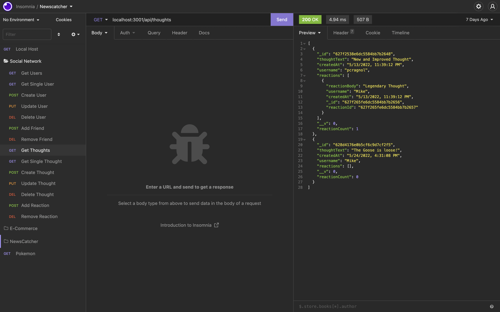

# Social Network API

[](https://opensource.org/licenses/MIT)

## Description

This a Node.js application that utilizes Mongoose and Express to create a social network where users can add friends, create thoughts, and react to others' thoughts.



## Demo

[Video Demonstration](https://drive.google.com/file/d/1bL83viUqbqzIH5Kh5pe4t4A95SJ6H3qV/view?usp=sharing)

## Usage

To use this application, you must first install Node.js and MongoDB. Then, install necessary dependencies with the following command:

```
npm i
```

Now you may start the application with the following command:

```
npm start
```

There is currently no front end for this application, so you must use Insomnia to execute all requests.

### Questions

If you have any questions about this repository, open an issue or contact me directly at [pcragnol@gmail.com](mailto:pcragnol@gmail.com). You can find more of my work at [pcragnol](https://github.com/pcragnol/).

---
© 2022 Peter Cragnoline

Licensed under [MIT License](LICENSE)
